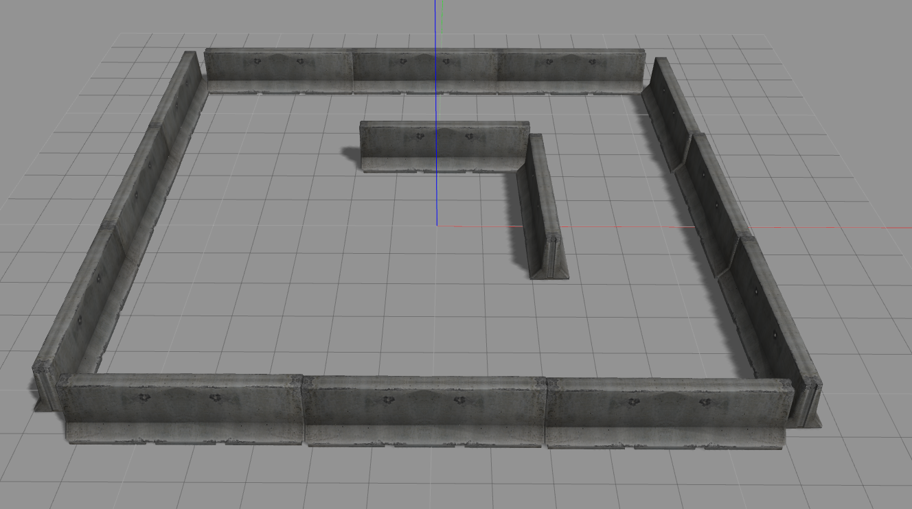
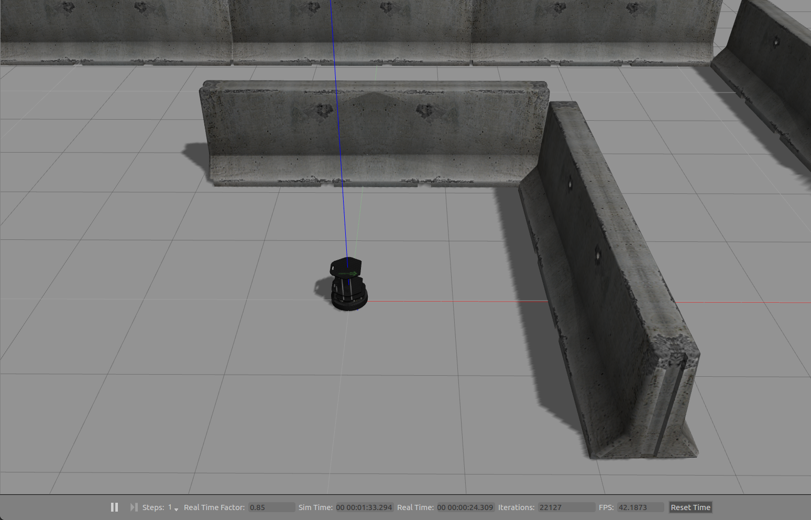

# Gazebo : 내 시뮬레이션에 터틀봇 추가하기

로보틱스를 공부하다보면 실제로 로봇을 가지고 실습해 보는것이 매우 중요하다  
그러나 좋은 로봇 프레임들은 성능이 좋은만큼 가격또한 만만하지 않다  
그래서 Gazebo 시뮬레이터를 이용해 시뮬레이션으로 실습을 대용하기도 한다  
뿐만 아니라, 처음 사용해보는 알고리즘은 동작이 어떻게될지 모르기 때문에  
비싼 로봇으로 실습하는 것은 로봇이 망가질 위험이 뒤따르며, 로봇의 마모를 재촉하기도 하므로 시뮬레이션은 로보틱스에서 굉장히 중요하다  

많은 ROS 문서들이 터틀봇을 이용하지만, 다들 turtlebot_world만을 이용하는 글이 많으며,  
자신이 만든 환경에 터틀봇을 추가하는 방법은 크게 알려져있지 않다  
이번 글에서는 내 환경에 터틀봇을 추가하는 방법에 대해서 다루지만, 다른 로봇을 추가하는 것 역시 방법은 비슷하므로 참고하길 바란다  

## .launch 파일

ROS 튜토리얼을 읽다보면 roslaunch 명령어를 사용했던 기억이 있을것이다  
roslaunch 명령어는 여러 노드를 사용하는 시스템을 불러오는 역할을 한다  
이 명령어가 없으면 노드의 갯수 만큼 사용자가 rosrun을 해줘야 하지만, .launch파일을 이용하여 한번에 불러온다고 이해하면 편하다  

> roslaunch turtlebot_gazebo turtlebot_world.launch

위 명령어는 turtlebot_gazebo 패키지 내의 turtlebot_world.launch 파일을 실행하겠다는 의미다  

## 내 시뮬레이션 환경 구축

다음 명령어로 Gazebo를 실행시켜 보자  

> gazebo

Gazebo 시뮬레이터로 자신이 원하는 환경을 모델링한다  
모델링 하는 환경의 (0,0,0) 지점(아래 그림의 적녹청 축이 만나는 지점)이 터틀봇의 최초 위치가 되므로 터틀봇의 위치를 잘 조절해서 모델링하자  

위와 같이 모델링이 완성되면 다음 경로에 저장하자  

> /MY_PROJECT_NAME/world

이로써 시뮬레이션을 위한 환경 구축은 완성되었다  
이제 이 환경에 터틀봇을 추가해 보도록 하자  

## 터틀봇 추가하기

우리가 원하는 센서가 달린 터틀봇은 turtlebot_gazebo 패키지에 존재한다  
다음 명령어를 입력해보자  

>roscd turtlebot_gazebo/launch/

roscd 명령어로 ROS 패키지가 정의돼있는 경로로 편하게 이동할 수 있다  
안에 파일들을 살펴보면 turtlebot_world.launch 파일을 확인할 수 있다  

다음은 turtlebot_world.launch의 전문이다  

	<launch>
  		<arg name="world_file"  default="$(env TURTLEBOT_GAZEBO_WORLD_FILE)"/>

  		<arg name="base"      value="$(optenv TURTLEBOT_BASE kobuki)"/> <!-- create, roomba -->
  		<arg name="battery"   value="$(optenv TURTLEBOT_BATTERY /proc/acpi/battery/BAT0)"/>  <!-- /proc/acpi/battery/BAT0 --> 
  		<arg name="gui" default="true"/>
  		<arg name="stacks"    value="$(optenv TURTLEBOT_STACKS hexagons)"/>  <!-- circles, hexagons --> 
  		<arg name="3d_sensor" value="$(optenv TURTLEBOT_3D_SENSOR kinect)"/>  <!-- kinect, asus_xtion_pro --> 

  		<include file="$(find gazebo_ros)/launch/empty_world.launch">
    			<arg name="use_sim_time" value="true"/>
    			<arg name="debug" value="false"/>
    			<arg name="gui" value="$(arg gui)" />
    			<arg name="world_name" value="$(arg world_file)"/>
  		</include>
  
  		<include file="$(find turtlebot_gazebo)/launch/includes/$(arg base).launch.xml">
    			<arg name="base" value="$(arg base)"/>
    			<arg name="stacks" value="$(arg stacks)"/>
    			<arg name="3d_sensor" value="$(arg 3d_sensor)"/>
  		</include>
  
  		<node pkg="robot_state_publisher" type="robot_state_publisher" name="robot_state_publisher">
    			<param name="publish_frequency" type="double" value="30.0" />
  		</node>
  
  		<!-- Fake laser -->
  		<node pkg="nodelet" type="nodelet" name="laserscan_nodelet_manager" args="manager"/>
  		<node pkg="nodelet" type="nodelet" name="depthimage_to_laserscan"
        	  args="load depthimage_to_laserscan/DepthImageToLaserScanNodelet laserscan_nodelet_manager">
    			<param name="scan_height" value="10"/>
    			<param name="output_frame_id" value="/camera_depth_frame"/>
    			<param name="range_min" value="0.45"/>
    			<remap from="image" to="/camera/depth/image_raw"/>
    			<remap from="scan" to="/scan"/>
  		</node>
	</launch>

launch 태그 안에 정의된 내용들은 전부 동시에 실행되는 내용들이다  
파일 안에는 터틀봇의 base모델, 센서들의 모델들이 정의되어 있다  
가장 중요한 10-15 행의 include 태그를 살펴보자  

 >include file="$(find gazebo_ros)/launch/empty_world.launch"
 
 find gazebo_ros 는 gazebo가 설치되어 있는 경로를 반환해준다  
 따라서 gazebo안에 존재하는 빈 world를 추가하겠다는 뜻이다  
 
 >arg name="world_name" value="$(arg world_file)"/
 
 arg 태그는 안에 작성된 내용을 인자로 넘겨준다는 뜻이다  
 안에 world_name이라고 되어있는 부분의 value에 world파일의 경로를 추가해주면 해당 world파일을 불러올 수 있다  

나머지 부분은 터틀봇의 base 및 센서들이 정의되어 있으므로 수정하지 말자  
launch파일의 수정은 자유롭게 해도 되나, 혹여 헷갈릴 수 있으므로 업로드된 launch 파일을 확인해보자  

결과적으로는 다음과 같이 된다  

우리의 시뮬레이션 환경에 터틀봇이 추가되었다  
다음은 이 터틀봇을 자유롭게 갖고 놀아보자  

