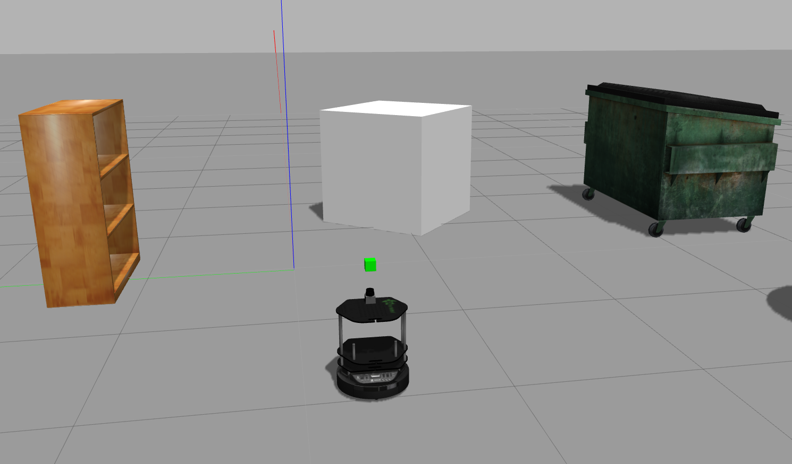
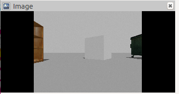

# CH3. 터틀봇에 카메라 추가하기

원래 터틀봇에 달려있던 depth카메라를 떼고 Lidar를 달았다.  
다시말해 우리는 카메라를 더이상 이용할 수 없게 된 셈이다.  
이제부터 Lidar는 그래로 두고 카메라를 터틀봇에 추가하는 작업을 해 볼 것이다.

## 카메라 모델링하기
우리가 .urdf.xacro를 이용해 Lidar 센서의 외형과 동작을 정의했듯이, 이번에는 카메라의 외형과 동작을 정의할 차례다.  
.xacro파일은 직관적인 문법으로 작성돼있으므로 크게 눈여겨 봐야할 곳만 적는다.  

10행, 20행의 태그안의 origin은 카메라의 위치를 나타낸다. link가 카메라의 물리적 위치, joint는 카메라 렌즈의 위치라 보면 편하다.  
26행의 gazebo reference이름은 link의 이름과 같아야 하므로 주의.  
sensor와 plugin태그는 카메라의 동작을 나타낸다.

모델링을 완료했으면 다음 경로에 저장하자

	$ROS_ROOT/../turtlebot_description/urdf/sensors

## 터틀봇에 카메라 추가
카메라 모델링을 완성했으니 이제는 직접 터틀봇에 추가해야 한다.  
다음 명령어로 파일을 수정하자.

	gedit $ROS_ROOT/../turtlebot_description/robots/kobuki_hexagons_hokuyo.urdf.xacro
	
이제 우리가 만든 카메라 모델을 추가해 준다.  

	<xacro:include filename="$(find turtlebot_description)/urdf/sensors/webcam.urdf.xacro"/>
	
링크또한 지정해 준다.

	<webcam parent="base_link"/>
	
위 두 줄은 비슷한 코드를 쉽게 발견할 수 있으므로 올바른 위치에 삽입해 주자.

## rviz로 확인하기

우리의 카메라가 정상적으로 동작하는지 확인해 보자.  
gazebo에서 터틀봇을 부르고 rviz를 통해 카메라 이미지가 제대로 나오는지 확인해 본다.  
각각 다른 터미널에서 아래 명령어를 입력하자.

	roslaunch turtlebot_gazebo turtlebot_world.launch
	rosrun rviz rviz
	

rviz에서는 fixed frame에 robot_base를 넣고  
Add 에서 by topic항목에서 image를 선택하고 topic이름을 넣어주면 된다.

